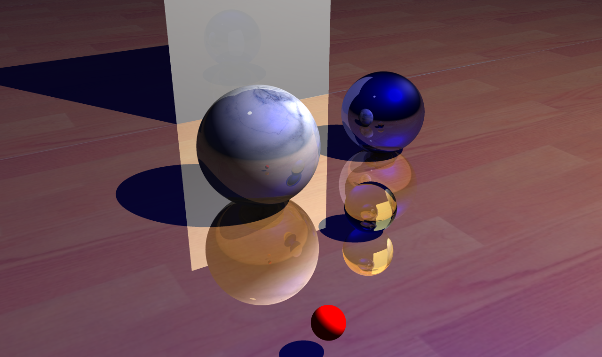

# A-5

计研三一

孙亚男

2020215223

sunyn20@mails.tsinghua.edu.cn

## 实验要求

实现以下材料中的光线跟踪算法
1)	材料见附件 RayTracing 文件夹
2)	使用代码框架，添加代码实现所需效果
3)	可从下面的网址下载参考资料：
http://www.ics.uci.edu/~gopi/CS211B/RayTracing%20tutorial.pdf

## 实验原理

该实验需要理解光线追踪的原理，如何合理的进行碰撞检测，还需要读懂原代码框架。

## 实验步骤

1. 将实验项目导入visual studio
2. 通读代码理解项目结构，找到可以添加的模块
   1. square collide
   2. cylinder collide
   3. bezier collide
   4. square light
   5. sphere light
3. 对于square，使用如下方法进行碰撞检测
   1. 通过Dx Dy的叉乘得到正方形的法向量
   2. 类比平面类求交点的方式求出射线与正方形所在平面的交点
      1. 若射线与平面近乎水平，无碰撞返回。
      2. 若射线的方向是背离平面的，无碰撞返回。
   3. 若射线与平面有交点，则计算从正方形中心到交点的向量OP在Dx，Dy方向的投影长度，若在[-|Dx|, |Dx|]， [-|Dy|,|Dy|]区间，则点落在正方形内部，否则，无碰撞返回。
   4. 若存在内部交点，则有碰撞，类比平面类构造碰撞结构的方式给数据赋值后返回。

## 实验效果

具体实验效果如下：

## 实验环境

Visual Studio 2019

## 实验遇到的问题或注意的地方

1. 一定要熟悉代码结构，通过其他已知类读懂不同变量的含义，与之前的项目中坐标系中指向天空的是y轴不同，该项目指向天空的是z轴。
2. 进行向量计算时要多画图，避免出现偏差。
3. 要为物体设置合适的漫反射值，最开始忘记设置所以是黑色的。

## 代码阅读笔记

