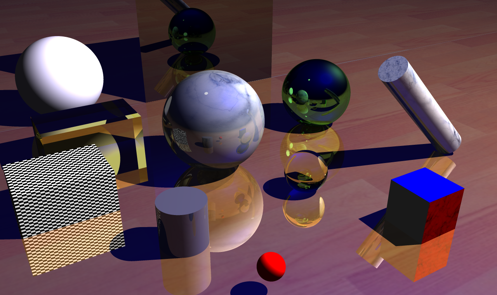

# A-5

计研三一

孙亚男

2020215223

sunyn20@mails.tsinghua.edu.cn

## 实验要求

实现以下材料中的光线跟踪算法
1)	材料见附件 RayTracing 文件夹
2)	使用代码框架，添加代码实现所需效果
3)	可从下面的网址下载参考资料：
http://www.ics.uci.edu/~gopi/CS211B/RayTracing%20tutorial.pdf

## 实验原理

该实验需要理解光线追踪的原理，如何合理的进行碰撞检测，纹理绘制，还需要读懂原代码框架。

## 实验步骤

1. 将实验项目导入visual studio

2. 通读代码理解项目结构，找到可以添加的模块
   1. square collide
   2. cylinder collide
   3. bezier collide
   4. square light
   5. sphere light
   
3. 正方形square绘制
   
   - 通过如下方法进行碰撞检测
      1. 通过Dx Dy的叉乘得到正方形的法向量
      2. 类比平面类求交点的方式求出射线与正方形所在平面的交点
         - 若射线与平面近乎水平，无碰撞返回。
         - 若射线的方向是背离平面的，无碰撞返回。
      3. 若射线与平面有交点，则计算从正方形中心到交点的向量OP在Dx，Dy方向的投影长度，若在[-|Dx|, |Dx|]， [-|Dy|,|Dy|]区间，则点落在正方形内部，否则，无碰撞返回。
      4. 若存在内部交点，则有碰撞，类比平面类构造碰撞结构的方式给数据赋值后返回。
   - 图片最后的灰色半透明正方形面片即为使用这种方法绘制的
   
4. 立方体cube绘制

   - 通过绘制多个square可以实现绘制一个立方体的效果
   - 可以为每个面设置不同的颜色和纹理

   - 图片右下的彩色正方体即为使用这种方法绘制的

5. 长方体cube绘制

   - 添加新的类——cube类 继承自Primitive
   - cube类成员变量
     - O 长方体体心
     - Dx Dy 一组相互垂直的向量，组成的面为与长方体一组对面平行的平面
     - x y z 长方体三个边的半边长
   - 通过如下方法进行碰撞检测
     1. 通过Dx Dy的叉乘得到长方体的第三个边长方向Dz
     2. 使用体心坐标和Dx Dy Dz以及半边长x y z计算得到六个面的面心以及法向量
     3. 类似于正方形求交点，依次计算光线与六个面的交点（最多有两个交点）
        - 若无交点，则无碰撞，返回
        - 若有一个交点，为对应碰撞信息赋值，返回
        - 若有两个交点，比较两个交点到光源的距离，选择较近的交点，为对应碰撞信息赋值，返回
   - 通过如下方法进行纹理绘制
     1. 计算crash_C到各个面的距离，判断在哪个面上
     2. 类比正方形绘制纹理的方法，进行绘制
   - 图片左侧透明和黑白格的长方体即为使用这种方法绘制的

6. 圆柱体cylinder绘制

   - 通过如下方法进行碰撞检测
     1. 将圆柱体当作一个无限长的柱体，将光线投影到与上下表面平行的平面上
     2. 类比圆形与光线求交点的方式，计算是否存在交点，若不存在，直接返回
     3. 否则，计算交点到上/下表面的距离，若不在上下表面围成的空间内，则不存在，直接返回
     4. 否则，为对应碰撞信息赋值，返回
   - 通过如下方式进行纹理绘制
     1. 计算crash_C到上下底面的距离，判断点在侧面还是底面上
     2. 若在底面上，则在底面上构造一对相互垂直的向量vertical vertical2，计算面心到点的向量在这两个向量上的投影长度，得到u和v
     3. 若在侧面上，则计算点到下底面的距离，得到u；将圆柱侧面展开，计算点到展开边的距离，得到v
   - 图片中间灰粉色圆柱和右侧斜放的圆柱即为使用这种方法绘制的

## 实验效果

具体实验效果如下：

## 实验环境

Visual Studio 2019

## 实验遇到的问题或注意的地方

1. 一定要熟悉代码结构，通过其他已知类读懂不同变量的含义，与之前的项目中坐标系中指向天空的是y轴不同，该项目指向天空的是z轴。
2. 进行向量计算时要多画图，避免出现偏差。
3. 要为物体设置合适的漫反射值，最开始忘记设置所以是黑色的。
4. 贴图时要注意根据点所在的位置分类进行计算。
5. 该项目的特殊点在于无法通过常规调试方法如输出等得到进行debug，只能通过最终结果图片反推可能原因，所以需要在调试过程中多积累经验。
   1. 如果出现大片黑色，很可能是碰撞检测出错，仔细检测向量的计算是否符合逻辑。
   2. 也可以尝试调整方向等参数对问题进行更精准的定位。
   3. 由于只实现了点光源，效果和实际生活中的效果还是有所不同，需要适当调整光源位置判断效果是否正确。比如我最开始绘制了一个纯白的正方体，但只有上面是白色，侧面是灰色，而背光面是纯黑色，我不确定是否是正确的效果，所以在侧面正对的方向添加一个点光源，发现侧面变成纯白色，故认为渲染效果正确。

## 代码阅读笔记

